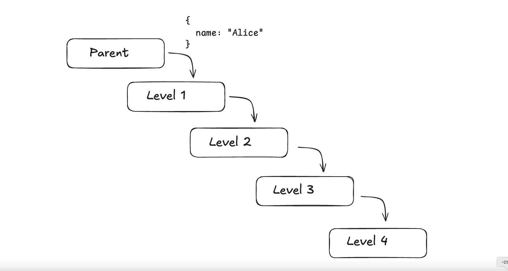
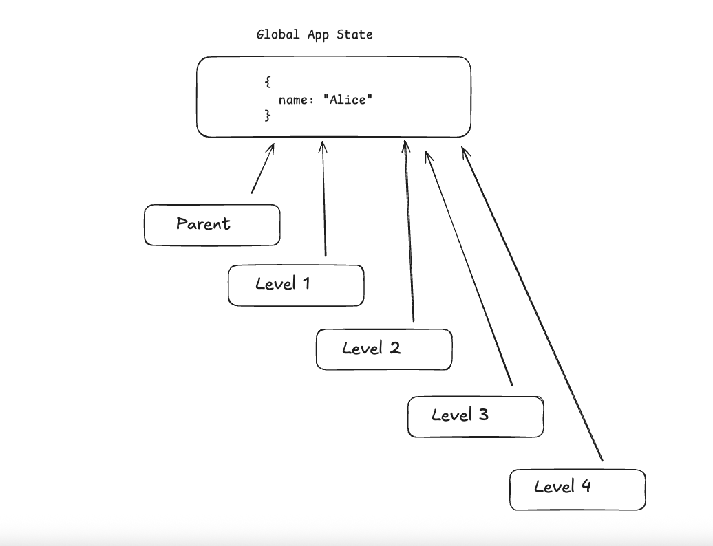

# ⚡️ [Next.js State Crash Course](https://github.com/jaimemendozadev/nextjs-state-crash-course)

<br />

## Table of Contents (TOC)

- [Prerequisites](#prerequisites)
- [Prop Drilling](#prop-drilling)
- [What is State Management?](#what-is-state-management)
- [React Context](#react-context)
- [1) Create the Context](#1-create-the-context)
- [2) Use the `React.Provider` as a WrapperComponent](#2-use-the-reactprovider-as-a-wrappercomponent)
- [3) The `children` prop and Using the StateProvider](#3-the-children-prop-and-using-the-stateprovider)


<br />

---
## Prerequisites

I'm going to assume you have access to the following, have working knowledge, or can figure out how to install AND use the following tools on your local machine:

- Node.js (installed locally on your computer)
- Git
- GitHub Account
- Code Editor of Your Choice (preferably [VS Code](https://code.visualstudio.com/) because it plays nicely with Next.js/TypeScript and autocompletes a lot of code for you.)

<br />

I also assume you've attended my [Next.js Crash Course](https://github.com/jaimemendozadev/nextjs-crash-course) and have a barebones understanding of the JavaScript and React fundamentals that are covered.


<br />

**IMPORTANT**: We will not be discussing how to implement [TypeScript (TS)](https://www.typescriptlang.org/) in this crash course as that would lead to cognitive overhead for everyone involved 🤯. **UNLESS THERE'S UNANIMOUS CONSENT** to use TS in the project, avoid getting TS errors in the codebase by using the all important escape hatch by adding the following line of code at the top of each `.ts` or `.tsx` file: `// @ts-nocheck`


<br />


[Back to TOC](#table-of-contents-toc)

---
# Prop Drilling

As you've probably already discovered, one of the nice things about [React.js](https://react.dev/) is that you can create reusable pieces of UI, that we call Components. Right here, I'm creating a `CustomForm` Component:

```
const CustomForm = ({value, handler, submitHandler}) => {

    return (
        <form onSubmit={submitHandler}>
          <label htmlFor="custom-input">
          <input id="custom-input" type="text" value={value} onChange={handler}>
        </form>

    )
}

```

<br />


When I render this `CustomForm` Component to the screen, I'm rendering it inside my `MyTodoApp` Component, which is what we call the top `"Parent"` level of the app. 


From the "Parent" level, I'm passing the `<CustomForm />` Component some [props](https://react.dev/learn/passing-props-to-a-component) so it can receive additional data that it needs to do it's job. 

You can think of `props` as Function arguments, variables, or the data in your app that you care about tracking.


```
const MyTodoApp = () => {

    const [inputValue, setInputValue] = useState("");
    
    const handleSubmit = (evt) => {
        // Rest of code
    }

    const onChange = (evt) => {
        const userValue = evt.target.value;
        setInputValue(userValue);
    }


    return (
        <CustomForm value={inputValue} handler={onChange} submitHandler={handleSubmit} />
    )
}

```

<br />

Passing props that are created and tracked in a top level `"Parent"` Component that then get passed down to a `"Child"` Component is easy to visualize because the data is only traveling down one-level deep.


BUUUUUUUUUUUUUUUUUUUUUUUT 

<br />

Imagine a scenario where we have a top level `"Parent"` Component that renders a `"Child"` Component. 




In the 👆🏽above screenshot, we have a simple piece of data that tracks the current User named `"Alice"`. From the top-level `"Parent"` Component, the User `Alice` gets passed down to the immediate `"Child"` Component at `Level 1`.


<br />

What if that`"Child"` Component ALSO becomes a `"Parent"` that renders its own `"Child"` Component? What if the User `Alice` also needs to get passed down one another level down in the app? 


<br />

<strong>Just imagine trying to BOTH visualize AND track the passage of props/data `N-levels` deep in the app</strong>.


In React, we `UNOFFICIALLY` call the passage of props/data down more than one-level deep as <strong>prop drilling</strong>.


[Back to TOC](#table-of-contents-toc)

---


## What is State Management? 

By no means is this an official Merriam-Webster's definition of `State`, so take it with a few grains of 🧂salt.

When we talk about `State` we're talking about the variables, the pieces of data, you care about tracking for the entire duration of your running app.

In the [previous section](#prop-drilling), we were talking about props, and we defined them as follows:

> You can think of `props` as Function arguments, variables, or the data in your app that you care about tracking.


<br />

`State` is synonymous with `props` because: 


> it's all about the data 🫵🏽 you care about ALWAYS TRACKING or ALWAYS HAVING ACCESS TO while your app is running.

<br />

When we drill props N-levels deep in the app, we risk understanding the data path of the props/data as it travels down to its destination. We might even forget where the data journey started. 😵‍💫 

<br />


BUUUUUUUUUUUUUUUUUUUUUUUT 

<br />

🤔 WHAT IF you 🫵🏽 had CONSTANT ACCESS to the props/data you care about tracking? 😮 Enter the idea of `State Management`. 




<br />


In the 👆🏽above screenshot, rather than localizing all the important data in one single Component, you could design a little mini Database (DB) that exists somewhere above all the React Components that you render on the screen. This little mini Database WILL ALWAYS KEEP TRACK of whatever data you care about tracking.


And the best part: EVERY COMPONENT IN YOUR APP, can have access to the `State` because it exists in the Global space of your app. 


Your job as a developer is to then:

- Decide what data you care about tracking;
- Setting up the `State` database and hooking up the React App to the `State` DB; and
- Eventually updating the Frontend `State` Database to reflect the most current information after you make a Backend API Operation.


We will be using the built-in React tooling to solve our `State` Management issues. Enter [React Context](https://react.dev/learn/passing-data-deeply-with-context).


<br />

[Back to TOC](#table-of-contents-toc)

___
## React Context

I didn't invent this truism, but ["Context changes everything"](https://www.bloombergmedia.com/press/bloomberg-media-launches-new-brand-campaign-context-changes-everything/) for our React app. 

The Context API gives us the ability to track all the `State`/data we care about and gives every part of our app access to the `State`.


<br />


[Back to TOC](#table-of-contents-toc)

___

## 1) Create the Context

Step 1 involves the use of a brand new React API Function called [`createContext`](https://react.dev/reference/react/createContext). It's self explanatory, but essentially when you pass an argument to this function, you're doing 2 things:

- You're telling React what is the `Shape` of the `State` data you're going to be tracking.
- The result of calling `createContext` is that you get a brand spanking ✨ new `React.Provider` Component.

<br />

If we go back to our Frontend Database concept, you can think of `createContext` as the function that provides the Database configuration that's used to start the Database connection.


When you invoke `createContext` for the first time, `IT'S IMPORTANT THAT YOU EXPLICITLY DEFINE THE SHAPE OF YOUR DATA` that you'll be tracking in your app.

The shape of the data becomes very important when you create your custom `React.Provider` component in the [next section](#2-use-the-reactprovider-as-a-wrappercomponent) to start the actual Frontend Database.


```
import { createContext, useState } from 'react';

export const AppContext = createContext({
  user: {},
  todos: [],
  setUser: () => null,
  setTodos: () => null,
});

```

<br />
<br />

[Back to TOC](#table-of-contents-toc)

___

## 2) Use the `React.Provider` as a WrapperComponent

Essentially, we're now creating a custom Component that we'll just call `StateProvider`. 

Notice below that before we return any `JSX`, we can define a whole lot of React functionality in the form of `useState` variables and updater functions, or even custom functions that do whatever we want. 

<br />


```
import { createContext, useState } from 'react';


// <AppContext /> code here


export const StateProvider = ({children}) => {

    const [user, setUser] = useState({});

    const [todos, setTodos] = useState([]);


    // More custom state/functions (if any)


    return (
        <AppContext.Provider value={{user, todos, setUser, setTodos}}>
          {children}
        </AppContext.Provider>
    )
}

```

<br />
<br />

Inside the `return` state of the `StateProvider` Component, we're using the `AppContext` component we [created earlier](#1-create-the-context) with the `createContext` function. But notice the `.Provider` method we access in the `AppContext`. 

```

return (
        <AppContext.Provider value={{user, todos, setUser, setTodos}}>
          {children}
        </AppContext.Provider>
    )

```


That's the `.Provider` Component React gives us, and by invoking it inside the `return` statement, we're essentially starting the Frontend database connection inside our app.

<br />
<br />

Also, notice the `value` prop that's attached to the `<AppContext.Provider>` component:

```

<AppContext.Provider value={{user, todos, setUser, setTodos}}>

```

When we start the Frontend database connection, the object that gets passed to the `value` prop `MUST MATCH THE SHAPE OF THE DATA` you defined when you ran the `createContext` function for the first time.


<br />


So we defined the shape of the `State` data in our config, we started the Frontend Database connection by invoking `.Provider` component in the `return` statement. But how do we connect the Frontend Databse to our entire React app?


<br />

[Back to TOC](#table-of-contents-toc)

___

## 3) The `children` prop and Using the StateProvider


Let's take a look at the `StateProvider` component we just wrote. Notice the `children` prop and how we're rendering it in the `return` statement?

```

export const StateProvider = ({children}) => {

    const [user, setUser] = useState({});

    const [todos, setTodos] = useState([]);


    // More custom state/functions (if any)


    return (
        <AppContext.Provider value={{user, todos, setUser, setTodos}}>
          {children}
        </AppContext.Provider>
    )
}
```


Without going into the details, the `children` prop represents everything that `React` could possibly render on the screen, `INCLUDING` other React Components.


So essentially, when we start the Frontend database connection by `returning` the `<AppContext.Provider>`, when we actually render our custom `<StateProvider />` Component, we're establishing the connection between our Frontend Database and the rest of the app like so:

<br />

```
import {StateProvider} from './somewhere';


export default function RootLayout({
  children,
}: Readonly<{
  children: React.ReactNode;
}>) {
  return (
    <StateProvider>
      <html lang="en">
        <body
          className={`${geistSans.variable} ${geistMono.variable} antialiased`}
        >
          {children}
        </body>
      </html>
    </StateProvider>
  );
}

```
<br />

What you're looking at in the code snippet above 👆🏽 is the inside our `/app/layout.tsx` file. 


This file represents `THE ENTIRE LAYOUT` that is available to our app, every single `/page` folder route, and all the React components rendered in those `/page` folder routes. 

But this file also uses the `children` prop, and that `children` prop happens to represent all the available React Components that are available in our app.

By wrapping the `<html>`, the `<body>` and rendering the `children` prop with our `<StateProvider>` component we created, we've essentialy connected our new Frontend Database to the rest of our app.

<br />

[Back to TOC](#table-of-contents-toc)

___